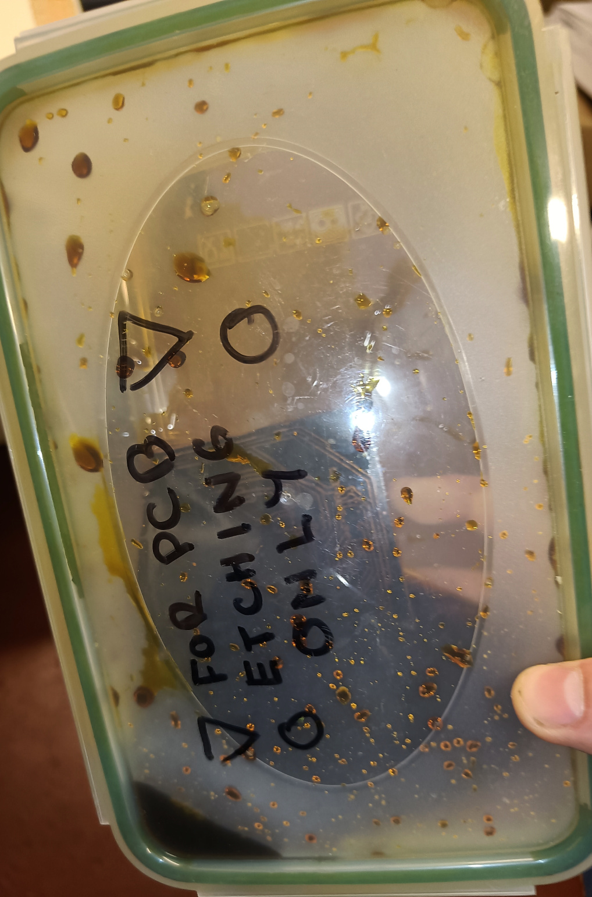
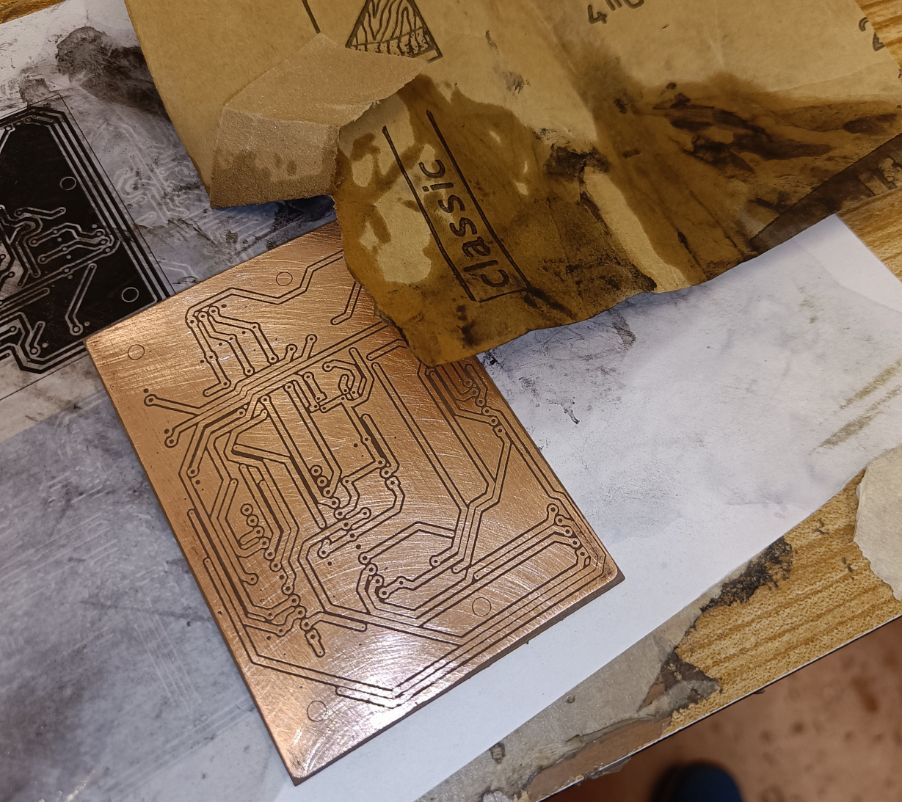
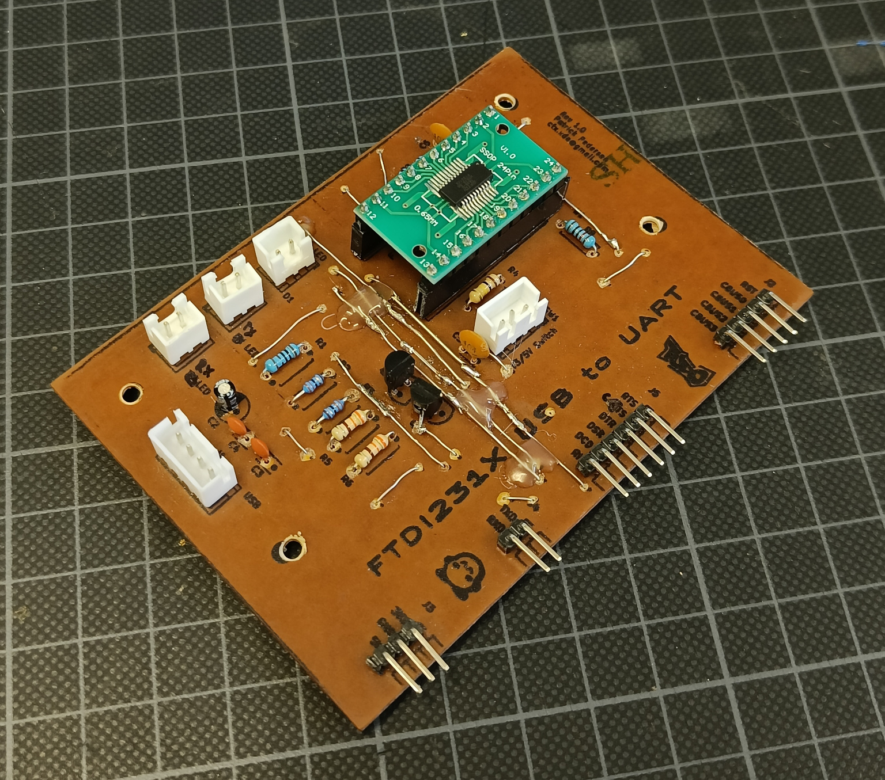

# How to etch your own PCBs <!-- omit in toc -->

> Contributors: @schnackus, @CTXz

> **Note:** This guide constantly evolves with every new PCB printed. Hence, any content here is subject to change!

After etching a fair amount of our own PCBs, we decided it would be a good idea to document the
process and publish it in form of a small tutorial. While process described here is based on our
supplies and equipment, it should hopefully provide a good starting point for anyone interested in
etching their own PCBs. 

## Table of Contents <!-- omit in toc -->
- [Materials and Tools ](#materials-and-tools-)
- [Safety Precautions ](#safety-precautions-)
- [Step 1: Designing the PCB](#step-1-designing-the-pcb)
	- [Edge Cuts](#edge-cuts)
	- [Traces](#traces)
	- [Jumpers](#jumpers)
	- [Copper Pour](#copper-pour)
	- [Silk Screen](#silk-screen)
- [Step 2: Preparing the Print](#step-2-preparing-the-print)
- [Step 3: Preparing for the Toner Transfer](#step-3-preparing-for-the-toner-transfer)
- [Step 3: Transferring the Circuit Design](#step-3-transferring-the-circuit-design)
- [Step 4: Error Correction](#step-4-error-correction)
- [Step 5: Etching the PCB](#step-5-etching-the-pcb)
- [Step 6: Applying the Silk Screen](#step-6-applying-the-silk-screen)
- [Step 7: Drilling](#step-7-drilling)
- [Step 8: Testing the PCB](#step-8-testing-the-pcb)
- [Step 9: Components and Soldering](#step-9-components-and-soldering)
- [Step 10: Final Test](#step-10-final-test)
- [Done!](#done)

## Materials and Tools 

We try to keep the choice of materials and tools as simple and accessible as possible.
The following lists contains all the materials and tools we use to etch our own PCBs:

Tools:
- A Laser printer
- An old clothes iron (ideally without holes and steam function)
- Scissors
- A plastic container (e.g. a Tupperware box)
- Dremel + Stand with 0.8mm drill bits
- A heat conductive surface (e.g. an old 3D printer bed, a large sheet of metal, etc.)

Materials:
- Single sided copper boards ([e.g. Amazon](https://www.amazon.de/-/en/dp/B07H3S1FKQ?psc=1&ref=ppx_yo2ov_dt_b_product_details))
- Ferric Chloride ([e.g Amazon](https://www.amazon.de/-/en/gp/product/B08X7H6X7W/ref=ppx_yo_dt_b_search_asin_title?ie=UTF8&psc=1))
- Tape
- Protective gloves
- Thermal Paper

Optional:
- Iso-propyl alcohol
- Sandpaper
- Face mask

## Safety Precautions 

The etching process involves the use of chemicals, heat and potentially dangerous tools.
Please handle all materials and tools with care and caution. Namely, we strongly recommend
the following safety precautions:

- Work in a decently ventilated area
- Wear protective gloves when handling the etching solution
- Wear a lab coat or old clothes when handling the etching solution
- Be cautious not to spill or splash/leak the etching solution
- Wear a face mask when sanding the PCB
- Be cautious of your hands when drilling the PCB

While the etching solution is not very dangerous, it can cause nasty stains and should still be
handled with care.

## Step 1: Designing the PCB

The first step is to design the PCB. We use [KiCad](https://kicad.org/) for this purpose.

When designing the PCB, it is important to keep in mind that we are limited to single sided PCBs.
While there are ways to etch double sided PCBs, our tools and materials are not really suited for
the task.

Please note that this tutorial does not cover KiCAD as a whole, but rather how to use KiCAD to
design a PCB that can be etched easily. If you are not familiar with KiCAD, we highly recommend
checking out a KiCAD tutorial first.

### Edge Cuts

As a first step, begin by defining the edge cuts of the PCB to the size of your copper board (or smaller
if you don't intend to use the entire board).

### Traces

Next, place all the components on the board and and connect them using traces where possible.
**Do not connect any GND connections, as these will be dealt with a copper pour later.**
Use the **bottom layer (B.CU)** for the traces, as that corresponds to how the circuit will be printed
onto the copper board. It is also highly recommended use a larger trace width (>= 0.5mm, 1mm recommended)
and a larger trace clearance (0.35mm recommended) to make the etching process less prone to errors.

### Jumpers

There will come a point where you will have to cross traces. On a signle sided PCB we can use
jumpers (i.e wires) jump over traces. Unfortunately, KiCAD isn't well equipped to deal with jumpers.
As a workaround, we can place vias and connect them with traces on top layer of the PCB.
This will provide you with a visual reference where to place the jumpers and prevent KiCAD
from complaining about unconnected traces in the design rules check.

There are several ways to realize jumpers on the PCB. Typically we use cut off leads from components
such as resistors, capacitors, etc. to create jumpers. Another way is to use [pre-made breadboard
jumpers](https://www.amazon.de/-/en/WayinTop-Breadboard-Different-Flexible-Tweezers/dp/B07PRGFW5Z)
which come in various lengths and colors. In this case, you will want to ensure the jumper traces
correspond to the available size. Wire can also be used to create jumpers. If you are feeling extra lazy,
you can also implement jumpers by directly soldering a isolated wire between the two disconnected points.
This will spare you the need to drill holes for a proper jumper. In this case, using vias is not necessary,
instead, directly connect the two pins with a trace on the top layer.

There are several methods for implementing jumpers on a PCB. Typically, we utilize cut-off leads from components such as resistors or capacitors to establish these connections.

Alternatively, [pre-made breadboard jumpers]((https://www.amazon.de/-/en/WayinTop-Breadboard-Different-Flexible-Tweezers/dp/B07PRGFW5Z)), or [0-Ohm resistors](https://www.reichelt.de/duennschichtwiderstand-axial-0-4-w-0-ohm-1--vi-mba02040z0000-p233662.html?&trstct=pos_1&nbc=1) offer another solution. When using these types of jumpers, it's important to ensure that the traces correspond to the available jumper/resistor sizes.

 Wire may also be employed to create jumpers and for those who feel lazy, directly soldering an isolated wire between the two disconnected points is also an option, saving the need to drill holes for a proper jumper. In such cases, vias are unnecessary; instead, connect the two pins directly with a trace on the top layer.

Unless you are directly soldering a wire between two points, it is recommended to use a larger default via size. For jumpers made out of thin leads or wires, a recommended inner diameter of 0.4mm and an outer diameter of 1mm is suggested. For larger leads or thicker wires, a inner diameter of 0.8mm and an outer diameter of 1.6mm is more suitable. Ensure that the "jumper traces" are aligned in straight lines in order to corresponds to the intended placement of the jumpers on the PCB.

### Copper Pour

Once the traces are placed, we can add a copper pour (filled zone) to the bottom layer. This will provide
a solid ground connection for all components and reduce the amount of etching required. For now, ensure that
"islands" are always removed, as this will ease jumping disconnected ground planes with jumpers. Also
set the Pad connection to "Solid" since thermal relief's are not necessary for self-etched PCBs and can
be easily ripped off when soldering. Once the copper pour is placed, add jumpers between any disconnected
ground planes. Once all ground planes are connected, set islands to never be removed and refill all zones.
When etching your own PCBs, you'll want as little copper to be removed as possible to reduce the etching
time and save etching solution.

Once the traces are positioned, we can introduce a copper pour (filled zone) onto the bottom layer. This ensures a big ground connection for all components. At this stage, it's important to set `Remove islands` to `Always`, as this will ease connecting disconnected ground planes with jumpers. Additionally, set the Pad connection to "Solid" since thermal reliefs are unnecessary for self-etched PCBs and can be easily ripped off during soldering. Once the copper pour is placed, proceed to add jumpers where necessary to link any disconnected ground planes. Once all ground planes have been connected, set `Remove islands` to `Never` and refill all zones. We keep islands in order to minimize the amount of copper that needs to be etched.
This will reduce the etching time and save etching solution.

### Silk Screen

If you are confident with your PCB layout, run a design rules check to ensure that there are no
errors in the PCB design. Once the design rules check is passed, you may begin to design the silk
screen. Ensure that silk screen is only placed on the top layer of the PCB, as that layer represents
the non-copper side of the PCB.

Finally, it doesn't harm to increase the size of the pads for the components. This will make

## Step 2: Preparing the Print

Once the PCB design is finished, we can prepare the print. For this, we need to export the PCB
as a SVG file. To do this, open the plot dialog via `File -> Plot...`. Then:

  1. Traces: Export a black and white SVG with the edge cuts and back copper layer (B.Cu).
  2. Silkscreen: Export a **mirrored** black and white SVG with the edge cuts and the front silkscreen layer (F.Silkscreen). To mirror the SVG, tick the `Print mirrored` checkbox.

Alternatively, the bottom layer can be mirrored, and the silkscreen layer can be left as it is. Just ensure that the orientation of both layers complements each other; otherwise, the layers will not be aligned!

Note: Strictly speaking, exporting the edge-cuts layer is not required. However, it does provide a valuable visual reference for aligning the copper board to the print.
 
Next, open the SVGs in Inkscape and place them on a single page. Feel free to place multiple
copies of of the layers on the page, that way you got a backup in case something goes wrong
during the printing process. Additionally, this also allows you to print multiple PCBs.

This is the last chance to fix the orientation of the layers. For a sanity check you may
place the copper board infront of the screen and confirm that the layers are mirrored correctly.

Before printing the layers onto the thermal paper, we highly recommend printing them onto ordinary paper first. This precaution ensures that if the scaling is incorrect or a footprint is inaccurate, thermal paper will not be wasted. **Always ensure that the scaling in the print settings is set to 100%**. If you are confident that everything is right, you may proceed to print the layout directly onto a sheet of thermal paper. Please be cautious when handling the thermal paper as the print can easily be scratched off.

## Step 3: Preparing for the Toner Transfer

Before we transfer the print onto the copper board, there are a couple of pre-emtive steps we can
take to make the process more reliable.

First, we can sand the copper board with a fine grit sandpaper. This will remove any oxidation
and flatten the surface for a better transfer. You'll want to sand it to the point where it looks
more shiny. Scratch marks are totally fine, just make sure not to sand it too much.

It is recommended wearing a face mask when sanding the copper board to avoid inhaling the dust.
A well ventilated area is also recommended.

Grab the printer toner transfer paper and align the copper board with its copper side
to the print of the back copper layer. Use tape to fixate the copper board to the print so it
doesn't move around during the transfer process. Finally, cut out the part of the print where
the PCB is located. Leave a margin of a few centimeters around the PCB when cutting the print!

Next, get a heat conductive surface (we are using an old print bed) and place the PCB onto it with
its masked copper side facing upward. You may also want to tape the PCB to the heat conductive surface
as that will keep it from moving around during the transfer process. Avoid placing the tape directly on
top of the PCB, instead use the margin around the PCB to fixate it.

Now it's time to fire up the iron and wait for it to heat up. We are using the highest temperature
setting.

## Step 3: Transferring the Circuit Design

Once the Iron has heated up, apply some heat to the heat conductive surface first (ex. from the bottom).
This will ensure the back side of the copper board is heated up as well. Then, place the iron on the print and
apply pressure.

You'll want to move the iron around to ensure the heat is applied evenly across.
If the toner starts to become visible through the paper, you're doing it right.
Once most of the toner is visible through the paper, you can remove the iron.

Wait for a short while and place the copper board along with the print into cold water. After pouring cold water,
you can remove the print from the copper board. If things went well, the toner should have transferred to the copper
board without any issues.

## Step 4: Error Correction

Unfortunately, things don't always go as planned. If the toner transfer turned out terrible, you are
probably better off starting over. However, if the transfer turned out okayish, you can try to
fix it by hand. Fix any broken traces by completing them with a fine permanent marker. Be cautious
not to short any traces. If a trace is shorting, you can scrape away the toner (ex. with a cutter).

## Step 5: Etching the PCB

The PCB is ready to be etched. For this, we need to prepare the etching solution. We are using
Ferric Chloride for this purpose. **Please be very cautious when handling the etching solution,
as it can easily permanently stain anything it gets in contact with**. As a concequence, it is
strongly advised to use a lab coat and gloves during this procedure.

Begin by pouring some of the Ferric Chloride into a plastic container. The amount should be enough to submerge the PCB. Then, shake the container to speed up the etching process. You'll typically want to shake it for about 5-10 minutes. Typically the
solution will start forming bubbles during when the etching process is nearly finished. It is good to check the progress of the etching process every now and then. Please use a tool or gloves to do this.

You will recognize that etching is complete when all exposed parts have have lost their shiny copper appearance and instead expose the brown color of non-conductive layer.

Once the etching process is complete, do not dispose of the etching solution, as it can be reused.

Next, rinse the PCB with water and remove the toner by sanding it with fine-grit sandpaper. Adding iso-propyl alcohol will ease this process.

## Step 6: Applying the Silk Screen

This step is optional, but it is a nice way to add some text to the top side of the PCB. The process
of applying the silk screen is virtually identical to the process of applying the circuit design, except
that there's no etching involved.

To apply the silk screen, place the non-copper side of the PCB onto the print of the top silk screen.

Once again, use tape to fixate the PCB to the print and cut out the part of the print
where the PCB is located. Ensure that the orientation of the silk screen aligns with the
copper side of the PCB. Then, apply a little heat to the heat conductive surface and place the
PCB with its copper side facing towards it. Place the iron on the print and apply pressure until
the toner becomes visible through the paper. Then, remove the iron and soak it in cold water and
peel the print off the PCB. Hopefully, the silk screen has transferred to the PCB without any issues.

## Step 7: Drilling

The PCB is almost finished. The final step involves drilling holes for the components. While we previously utilized a Dremel with a drill stand, we have transitioned to using a drill press after purchasing one for the makerspace. If you wish to do things properly, it is recommended to always use the appropriate drill bit that matches the footprint's hole sizes. That being said, in order to save cost and time, we tend to only use two drill bit sizes. For smaller holes (ex. for components with thin leads) we use a 0.8mm bit. For larger holes (ex. resistors, capacitors) we use a 1mm bit.

Before you begin drilling, consider these important tips:

- Wear protective goggles at all times to prevent potential eye injuries from broken drill bits.
- Always be mindful of your hands to avoid accidental injury while handling the drill.
- Keep the PCB stable and avoid moving it during drilling to prevent damage to the drill bit.
- Drill the holes from the copper side. **It is not recommended to drill the holes from the non-copper side, as the silk screen is usually not perfectly aligned with the copper side.**

Place the PCB with the copper side facing upwards and carefully drill the holes for the components. This process requires time, caution and patience, so please don't rush it!

## Step 8: Testing the PCB

At this point you'll typically want to double check the PCB for any shorts or other errors.
We recommend using a multi-meter's continuity test to check if all connections are correct.
Be aware that some shorts are very hard to spot and may be very small.

## Step 9: Components and Soldering

The PCB is now ready to be populated with components. We recommend starting with flatter and smaller components first and then moving on to larger components. It is also recommended to use a PCB holder for this task. Since the PCB is single sided and rather thin, you will want to use a lower soldering temperature than for most professionally manufactured PCBs. We are typically using around 380°C with lead-free solder. Using higher temperatures can easily rip of the pads. Using flux is also strongly  recommended, since there's no solder mask on the PCB to prevent solder from flowing to unwanted places. If you happen to accidentally create a solder bridge, solder wick or solder suckers will do a good job seperating the bridged pads. We found it to often be easier to desolder on self-etched PCBs than on professionally manufactured PCBs due to the lower thermal mass.

## Step 10: Final Test

Once all components are soldered, you will want to perform a final test. Before powering the PCB,
it is recommended to check for shorts again, especially between the power rails. If everything
looks good, you can power the PCB and check if everything works as expected. Should you find any
bad connections caused by damaged traces or pads, we recommend using jumper wires to fix them.

## Done!

And that's how we etch our own PCBs! From our experience, it might take a couple of tries to get
the hang of it, but once you do, it's a very reliable and fast way to produce PCBs.

We find the ability to etch our own PCBs very useful for cases where ording PCBs from a manufacturer
(e.g. JLCPCB, PCBWay, etc.) still doesn't cut tight deadlines. Of course, for more complex PCBs
with many layers, it is still recommended to order them from a manufacturer.